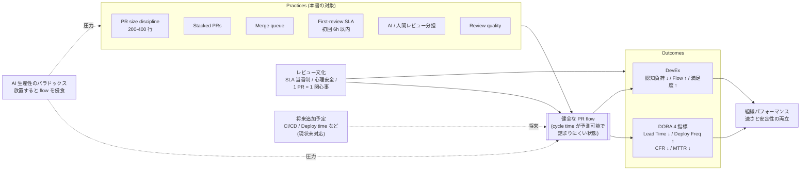

# 開発プロセスの実践 (Practices)

ソフトウェア開発の生産性に関する一般的な実践をまとめた場所。upflow が計測しようとしているものの「業界文脈」と「具体策」を、ベンダー中立な形で記録する。

## なぜこのディレクトリがあるか

upflow は cycle time / DORA 指標を計測するダッシュボードだが、**「数字を見たあとどうするか」が抜けやすい**。ここに業界の実践を整理しておくことで、

- ダッシュボード上で見えた問題に対し、確立された対策をすぐ参照できる
- RDD で「この設計判断は業界実践のどこに位置するか」を引用できる
- 個別ツールの宣伝に流されず、原則に立ち戻れる

を狙う。

## 本書のスコープ

DORA は 2025 年現在、技術・プロセス・文化など **34 の能力** を定義している。本書はそのうち **「PR を作って main までたどり着くまで」** に集中する。

| 状態                | 範囲                                                                | 章                             |
| ------------------- | ------------------------------------------------------------------- | ------------------------------ |
| ✅ **扱う**         | PR サイズ、段階的 PR、マージキュー、初回レビュー SLA                | [pr-flow/](./pr-flow/)         |
| ✅ **扱う**         | AI と人間のレビュー分担、レビューの質                               | [code-review/](./code-review/) |
| ✅ **扱う**         | DORA / SPACE / DevEx の指標、AI パラドックス                        | [metrics/](./metrics/)         |
| 🟡 **将来追加予定** | CI / CD / test automation / **Deploy time** (cycle time の構成要素) | `delivery/` (未作成)           |
| 🟡 **将来追加予定** | Trunk-based development / Working in small batches (用語整理)       | `delivery/` または独立         |
| ❌ **当面扱わない** | アーキテクチャ (loosely coupled / flexible infra / DB change mgmt)  | —                              |
| ❌ **当面扱わない** | セキュリティ (pervasive security)                                   | —                              |
| ❌ **当面扱わない** | 観測性・運用 (monitoring / observability / proactive notification)  | —                              |
| ❌ **当面扱わない** | 文化・組織 (Westrum / learning culture / 心理的安全 / WIP limits)   | —                              |

DORA 34 能力との 1 対 1 対応マップは [metrics/dora.md の「DORA 34 能力と本書の対応マップ」](./metrics/dora.md#dora-34-能力と本書の対応マップ) を参照。

**当面扱わないものを書かない理由**: upflow の計測対象 (git ベースの PR / レビューデータ) と直接結びつかないから。書けば嘘ではないが、本書を引用する RDD の決定材料にはならない。書く必要が出たら章を追加する。

## 全体俯瞰図

本書のスコープ内の実践と結果の因果関係。DORA の能力モデル ([continuous-delivery 図](https://dora.dev/capabilities/continuous-delivery/)) の構造を借りて、PR flow に絞った形で書いたもの。

| 層                     | 何                                             | DORA 元図との対応                 |
| ---------------------- | ---------------------------------------------- | --------------------------------- |
| **Practices**          | 個別の手段 (規律・ツール・運用)                | Technical practices ボックス      |
| **健全な PR flow**     | 中核能力 (本書で扱う「能力」)                  | Continuous delivery               |
| **レビュー文化**       | 横から効く要因                                 | Westrum culture                   |
| **Outcomes**           | DORA + DevEx の両面                            | SDO performance + Less burnout 等 |
| **組織パフォーマンス** | 最終結果                                       | Organizational performance        |
| **AI パラドックス**    | 本書独自。何もしないと flow を侵食する外部圧力 | (DORA 元図にはなし)               |
| **将来追加予定**       | CI/CD / Deploy 等。flow に効くが現状本書未対応 | DORA 元図には含まれる             |

## AI 時代の前提

DORA 2025 の調査で、AI コーディング支援の普及により次のことが起きている:

- 個人レベルの出力は劇的に増えた (PR マージ数 +98%, タスク完了 +21%)
- しかし組織のデリバリー指標は横ばい〜悪化
- PR レビュー中央値 +441%、レビューなしマージ +31%、PR サイズ +51.3%

つまり **「AI が速く書けるほど、レビューと統合の詰まりが顕在化する」** ことが業界規模で起きている。本ディレクトリの実践は、この前提のもとで読む。

詳しくは [metrics/ai-productivity-paradox.md](./metrics/ai-productivity-paradox.md)。

## 章構成

### [pr-flow/](./pr-flow/) — PR を速く流す

PR が滞らずに main までたどり着くための実践。

- [pr-size-discipline.md](./pr-flow/pr-size-discipline.md) — PR サイズの規律 (200/400 行ルール)
- [stacked-prs.md](./pr-flow/stacked-prs.md) — 段階的 PR で大きな機能を小さく分割
- [merge-queue.md](./pr-flow/merge-queue.md) — マージキューで rebase 地獄を消す
- [first-review-sla.md](./pr-flow/first-review-sla.md) — 初回レビュー応答時間の SLA

### [code-review/](./code-review/) — レビューをまっとうにする

レビューを速く・深く回すための実践。

- [ai-human-split.md](./code-review/ai-human-split.md) — AI と人間の役割分担
- [review-quality.md](./code-review/review-quality.md) — レビューの質を保つ仕掛け

### [metrics/](./metrics/) — 計測する

計測フレームワークと、AI 時代に何が変わったか。

- [dora.md](./metrics/dora.md) — DORA 4 指標
- [space-devex.md](./metrics/space-devex.md) — SPACE / DevEx / DX Core 4
- [ai-productivity-paradox.md](./metrics/ai-productivity-paradox.md) — AI 生産性のパラドックス

## 各ファイルの構成

各ファイルは次の節を持つ:

1. **要点** (1〜2 文)
2. **なぜ重要か** (背景と根拠)
3. **具体的な実践** (How)
4. **落とし穴** (やりがちなアンチパターン)
5. **upflow での扱い** (計測機能として実装済か / 未実装か / RDD 化されているか)
6. **参考資料** (一次ソース)

「なぜ重要か」は必ず根拠 (調査・事例・データ) を伴う。「経験則として」だけで終わらせない。

## 書き方の方針

- **ベンダー中立**: 固有名詞 (CodeRabbit, GitHub, Aviator 等) は出すが、必ず「代替候補」も併記する
- **数字を出す**: 「速くなる」ではなく「62% 削減事例」「PR サイズ +51.3%」のように出典付きで
- **upflow 固有の事情と一般原則を分ける**: 一般原則は本文、upflow 個別事情は「upflow での扱い」節に隔離
- **更新時は出典の年を確認**: 2026年現在の実践と 5年前の実践は違う。古い記事を引用するときは「〇年時点では」と明記
